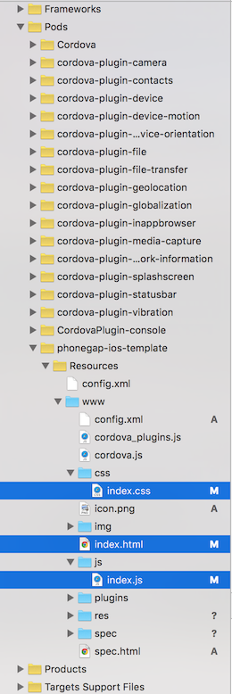
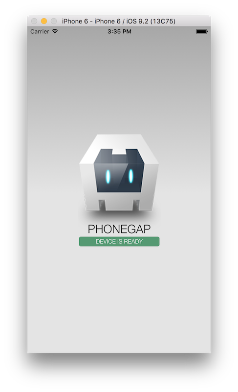
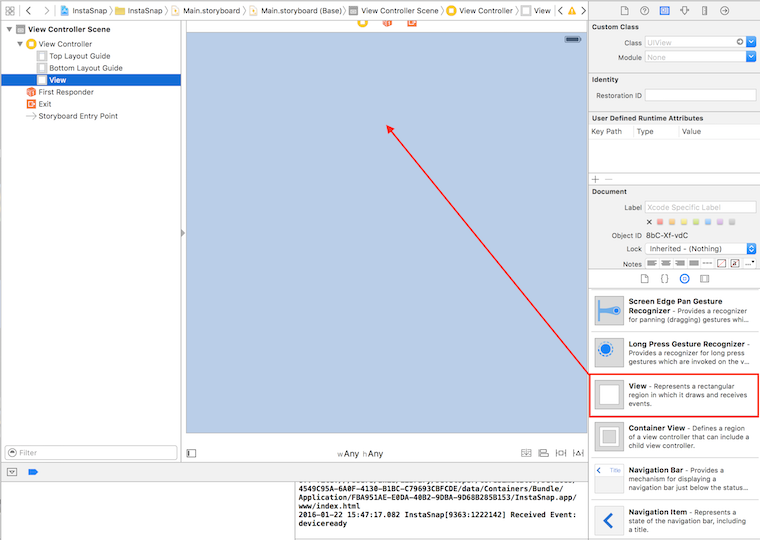
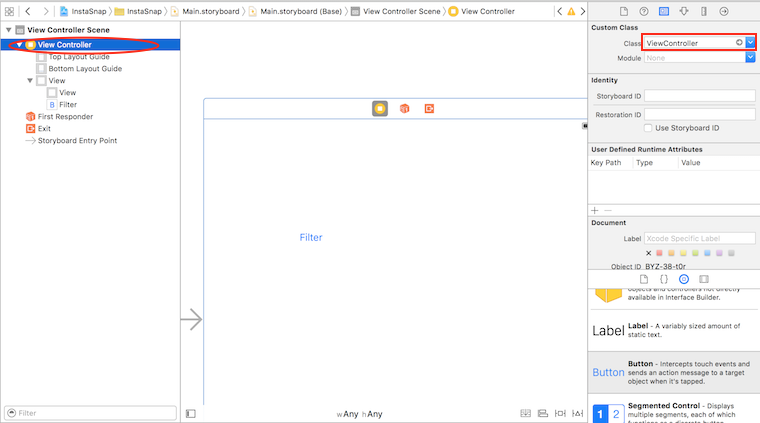

# PhoneGap day workshop

This workshop requires a Macintosh computer and an iOS device (version 8 or above).

We will be building a very simple Instagram like app using iOS native features and web tech.

## Steps

0. Follow steps in [phonegap-webview-ios](https://github.com/phonegap/phonegap-webview-ios) to set up a new iOS native project
1. Updating `www`
  1. Clone [phonegap-start](https://github.com/phonegap/phonegap-start) somewhere temporary
  2. Delete `www/index.html`, `www/css/index.css` and `www/js/index.js` under `Pods/Pods/phonegap-ios-template/Resources`. 
  3. Replace files from Step 2.2 with respective files from the `phonegap-start` repository.

    
  4. Run the app

    
2. Adding native view elements to storyboard
  1. Click on `Main.storyboard` and drag & drop a `View` to it. Add constraint to to center the `View` horizontally
    
    
  2. Drag&drop a `Button` to storyboard and give and label it "Surprise". Add constraint to it to center horizontally
  3. Replace ViewController.h with the following code
      ```Objective-C
      #import <UIKit/UIKit.h>
      #import <Cordova/CDVViewController.h>
      #import <AVFoundation/AVCaptureSession.h>
      #import <AVFoundation/AVCaptureVideoPreviewLayer.h>
      #import <AVFoundation/AVMediaFormat.h>
      #import <AVFoundation/AVCaptureInput.h>
      #import <AVFoundation/AVCaptureOutput.h>
      #import <AVFoundation/AVVideoSettings.h>
      #import <ImageIO/ImageIO.h>
      
      @interface ViewController : CDVViewController
        @property(nonatomic, weak) IBOutlet UIView *vImagePreview;
        @property (weak, nonatomic) IBOutlet UIButton *surpriseBtn;
        @property(nonatomic, retain) AVCaptureStillImageOutput *stillImageOutput;
        - (void)captureNow:(void (^)(NSData*))sendImageToJS;
      @end
      ```
  4. In Main.storyboard make sure "ViewController" is selected (as shown below).
   
    
  5. Go back to storybord, select the assistant editor on the top right, ctrl-click on UIView and drag it to the `vImagePreview` property on the right editor
    
    
  
  6. Repeat same operation on Button, drag it to the surprise `surpriseBtn` property on the right editor
    
    
  
3. add the following code to the `ViewController.m` file

    ```Objective-C
    - (void)viewDidAppear:(BOOL)animated {
        [super viewDidAppear:animated];

        // hide button
        self.surpriseBtn.hidden = YES;

        // creating capture session
        AVCaptureSession *session = [[AVCaptureSession alloc] init];
        session.sessionPreset = AVCaptureSessionPresetMedium;

        // creating a view layer to preview the capture using the session above
        CALayer *viewLayer = self.vImagePreview.layer;
        NSLog(@"viewLayer = %@", viewLayer);

        AVCaptureVideoPreviewLayer *captureVideoPreviewLayer = [[AVCaptureVideoPreviewLayer alloc] initWithSession:session];

        // setting the session bounds
        captureVideoPreviewLayer.frame = self.vImagePreview.bounds;
        [captureVideoPreviewLayer setVideoGravity:AVLayerVideoGravityResizeAspectFill];

        // adding the preview layer to the view
        [self.vImagePreview.layer addSublayer:captureVideoPreviewLayer];

        // setting the device (front vs back facing camera)
        AVCaptureDevice *device = [AVCaptureDevice defaultDeviceWithMediaType:AVMediaTypeVideo];
        NSError *error = nil;

        AVCaptureDeviceInput *input = [AVCaptureDeviceInput deviceInputWithDevice:device error:&error];
        if(!input) {
            NSLog(@"Error: trying to open camera: %@", error);
        }

        [session addInput:input];

        self.stillImageOutput =[[AVCaptureStillImageOutput alloc] init];
        NSDictionary *outputSettings = @{ AVVideoCodecKey: AVVideoCodecJPEG };
        [self.stillImageOutput setOutputSettings:outputSettings];
        [session addOutput:self.stillImageOutput];

        [session startRunning];
    }
    - (void) captureNow:(void (^)(NSData*)) sendImageToJS {

        AVCaptureConnection *videoConnection = nil;
        for(AVCaptureConnection *connection in self.stillImageOutput.connections) {
            for(AVCaptureInputPort *port in [connection inputPorts]) {
                if([[port mediaType] isEqual:AVMediaTypeVideo]) {
                    videoConnection = connection;
                    break;
                }
            }
            if(videoConnection) { break; }
        }
        NSLog(@"Requesting capture from: %@", self.stillImageOutput);

        if([videoConnection isEnabled]) {
            [self.stillImageOutput captureStillImageAsynchronouslyFromConnection:videoConnection completionHandler:^(CMSampleBufferRef imageSampleBuffer, NSError *error) {
                CFDictionaryRef exifAttachments = CMGetAttachment(imageSampleBuffer, kCGImagePropertyExifDictionary, NULL);
                if(exifAttachments) {
                    NSLog(@"attachments: %@", exifAttachments);
                } else {
                    NSLog(@"No attachments");
                }
                NSData* imageData = [AVCaptureStillImageOutput jpegStillImageNSDataRepresentation:imageSampleBuffer];
                sendImageToJS(imageData);
            }];
        } else {
            NSLog(@"Video connection is disabled");
        }

        self.surpriseBtn.hidden = NO;
    }
    
    ```
    
4. Click on File > New > File. Select iOS/Source -> Cocoa Touch Class. Click Next and name it `MyCustomCameraPlugin`

  

  
  
  1. Your `MyCustomCameraPlugin.h` should look like this
      ```Objective-C
      #import <Cordova/CDVPlugin.h>
      
      @interface MyCustomCameraPlugin : CDVPlugin
      -(void)captureNow:(CDVInvokedUrlCommand*) command;
      -(void)surprise;
      @end
      
      ```
  2. Your `MyCustomCameraPlugin.m` should look like this

      ```Objective-C
      #import "MyCustomCameraPlugin.h"
      #import "ViewController.h"
      
      @implementation MyCustomCameraPlugin
      -(void)captureNow:(CDVInvokedUrlCommand *)command {
          NSLog(@"Capturing now...");
          ViewController* mvc = (ViewController*)[self viewController];
          [mvc captureNow:^(NSData* imageData) {
              NSLog(@"Sending imageData back to Javascript");
              CDVPluginResult* pluginResult = [CDVPluginResult resultWithStatus:CDVCommandStatus_OK messageAsString:[imageData base64EncodedStringWithOptions:NSDataBase64Encoding64CharacterLineLength]];
              [self.commandDelegate sendPluginResult:pluginResult callbackId:command.callbackId];
          }];
      }
      -(void)surprise {
          [self.commandDelegate evalJs:@"app.surprise();"];
      }
      @end
      ```
5. Add the following lines in `Pods/phonegap-ios-template/Resources/www/index.html` after *line 38*

  ```HTML
    <section id="imageSection">
        
    </section>
    <button type="button" id="captureNowBtn">Capture Nao!</button>
  ```
  1. Also add the following css link tag

    ```HTML
    <link rel="stylesheet" type="text/css" href="css/image.css">
    ```
  2. Your `Pods/phonegap-ios-template/www/js/index.js` should look like this

    ```JavaScript
      var app = {
          clean: false,
          // Application Constructor
          initialize: function() {
              this.bindEvents();
          },
          // Bind Event Listeners
          //
          // Bind any events that are required on startup. Common events are:
          // 'load', 'deviceready', 'offline', and 'online'.
          bindEvents: function() {
              document.addEventListener('deviceready', this.onDeviceReady, false);
          },
          // deviceready Event Handler
          //
          // The scope of 'this' is the event. In order to call the 'receivedEvent'
          // function, we must explicitly call 'app.receivedEvent(...);'
          onDeviceReady: function() {
              app.receivedEvent('deviceready');
          },
          // Update DOM on a Received Event
          receivedEvent: function(id) {
              var parentElement = document.getElementById(id);
              var listeningElement = parentElement.querySelector('.listening');
              var receivedElement = parentElement.querySelector('.received');
              listeningElement.setAttribute('style', 'display:none;');
              receivedElement.setAttribute('style', 'display:block;');
              console.log('Received Event: ' + id);
              var captureNowBtn = document.getElementById("captureNowBtn");
              captureNowBtn.addEventListener('click', this.captureNow);
          },
          captureNow: function() {
              console.log("JS::captureNow");
              var win = function(r) {
          
                  if(app.clean === false) {
                      // deleting deviceready
                      var deviceready = document.getElementById("deviceready");
                      var drp = deviceready.parentElement;
                      drp.removeChild(deviceready);
          
                      // changing app css a bit
                      var appCss = document.getElementsByClassName("app")[0];
                      appCss.style.top = "25%";
                      appCss.style.background = "none";
          
                      // deleting title
                      var h1 = document.getElementsByTagName("h1")[0];
                      var parentH1 = h1.parentElement;
                      parentH1.removeChild(h1);
          
                      app.clean = true;
                  }
                  
                  var myPic = document.getElementById("myPic");
                  myPic.src = "data:image/jpeg;base64,"+r;
              };
              
              var fail = function(e) {
                  console.log("An error occurred", e.message)
              };
              cordova.exec(win, fail, 'MyCamera', 'captureNow', []);
          },
          surprise: function() {
              var filters = ["grayscale", "blur", "saturate", "sepia", "invert", "brightness", "contrast", "opacity"];
              var imageSection = document.getElementById("imageSection");

              imageSection.className = filters[Math.floor((Math.random() * 10) + 1)];
          }
      };

      app.initialize();
    ```
  3. Create a new file under `Pods/phonegap-ios-template/Resources/www/css`, name it `image.css` and add this to it

      ```CSS
      .grayscale img
      {
          filter: grayscale(1);
          -webkit-filter: grayscale(1);
          -moz-filter: grayscale(1);
          -o-filter: grayscale(1);
          -ms-filter: grayscale(1);
      }

      .grayscale img:hover img:active
      {
          filter: grayscale(0);
          -webkit-filter: grayscale(0);
          -moz-filter: grayscale(0);
          -o-filter: grayscale(0);
          -ms-filter: grayscale(0);
      }

      .blur img
      {
          filter: blur(5px);
          -webkit-filter: blur(5px);
          -moz-filter: blur(5px);
          -o-filter: blur(5px);
          -ms-filter: blur(5px);
      }

      .blur img:hover img:active
      {
          filter: blur(0);
          -webkit-filter: blur(0);
          -moz-filter: blur(0);
          -o-filter: blur(0);
          -ms-filter: blur(0);
      }

      .saturate img
      {
          filter: saturate(500%);
          -webkit-filter: saturate(500%);
          -moz-filter: saturate(500%);
          -o-filter: saturate(500%);
          -ms-filter: saturate(500%);
      }

      .saturate img:hover img:active
      {
          filter: saturate(100%);
          -webkit-filter: saturate(100%);
          -moz-filter: saturate(100%);
          -o-filter: saturate(100%);
          -ms-filter: saturate(100%);
      }

      .sepia img
      {
          filter: sepia(1);
          -webkit-filter: sepia(1);
          -moz-filter: sepia(1);
          -o-filter: sepia(1);
          -ms-filter: sepia(1);
      }

      .sepia img:hover img:active
      {
          filter: sepia(0);
          -webkit-filter: sepia(0);
          -moz-filter: sepia(0);
          -o-filter: sepia(0);
          -ms-filter: sepia(0);
      }

      .invert img
      {
          filter: invert(1);
          -webkit-filter: invert(1);
          -moz-filter: invert(1);
          -o-filter: invert(1);
          -ms-filter: invert(1);
      }

      .invert img:hover img:active
      {
          filter: invert(0);
          -webkit-filter: invert(0);
          -moz-filter: invert(0);
          -o-filter: invert(0);
          -ms-filter: invert(0);
      }

      .brightness img
      {
          filter: brightness(50%);
          -webkit-filter: brightness(50%);
          -moz-filter: brightness(50%);
          -o-filter: brightness(50%);
          -ms-filter: brightness(50%);
      }

      .brightness img:hover img:active
      {
          filter: brightness(100%);
          -webkit-filter: brightness(100%);
          -moz-filter: brightness(100%);
          -o-filter: brightness(100%);
          -ms-filter: brightness(100%);
      }

      .contrast img
      {
          filter: contrast(0.3);
          -webkit-filter: contrast(0.3);
          -moz-filter: contrast(0.3);
          -o-filter: contrast(0.3);
          -ms-filter: contrast(0.3);
      }

      .contrast img:hover img:active
      {
          filter: contrast(1);
          -webkit-filter: contrast(1);
          -moz-filter: contrast(1);
          -o-filter: contrast(1);
          -ms-filter: contrast(1);
      }

      .opacity img
      {
          opacity:0.3;
      }

      .opacity img:hover img:active
      {
          opacity:1;
      }

      img{
          -webkit-transition: all 0.3s ease-in-out;
          -moz-transition: all 0.3s ease-in-out;
          -o-transition: all 0.3s ease-in-out;
          -ms-transition: all 0.3s ease-in-out;
          transition: all 0.3s ease-in-out;
          width: 240px;
      }
      img:hover img:active{
          -webkit-transform: scale(1.1);
          -moz-transform: scale(1.1);
          -o-transform: scale(1.1);
          transform: scale(1.1);
      }

      ```
6. Go back to the assistant editor with `Main.storyboard` on the left and `ViewController.m` on the right and Ctrl-drag from Surprise button to just above the `captureNow` method.
  
  

  1. create an action and name it `surpriseMe` and add the following code to it
    ```Objective-C
    - (IBAction)surpriseMe:(id)sender {
        MyCustomCameraPlugin *plugin = [self.pluginObjects objectForKey:@"MyCustomCameraPlugin"];
        [plugin surprise];
    }
    
    ```
  2. Also add this header at the very top
  
    ```Objective-C
    #import "MyCustomCameraPlugin.h"
    ```
7. Add the following lines to your `Pods/phonegap-ios-template/Resources/www/config.xml` between the two `<widget>` tags
  
  ```XML
  <feature name="MyCamera">
    <param name="ios-package" value="MyCustomCameraPlugin" />
  </feature>
  ```
8. Run the app!
